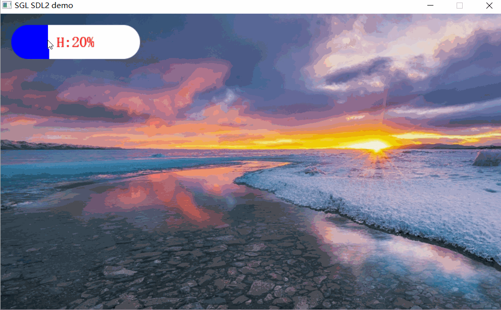
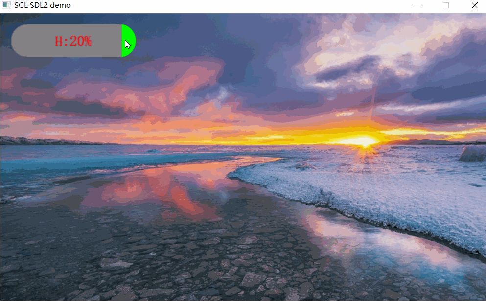

## Creating Sliders
Create a slider as follows:
```c
int main(void)
{
    ...
    sgl_obj_t *slider = sgl_slider_create(NULL);
    sgl_obj_set_pos(slider, 20, 20);
    sgl_obj_set_size(slider, 200, 50);
    ...

    while(1) {
        sgl_task_handle();
    };
}
```
The effect is as follows:  


## Setting Slider Text
Use a `label` to set the slider's text display as follows:
```c
int main(void)
{
    ...
    sgl_obj_t *slider = sgl_slider_create(NULL);
    sgl_obj_set_pos(slider, 20, 20);
    sgl_obj_set_size(slider, 200, 50);

    sgl_obj_t *label = sgl_label_create(slider);
    sgl_obj_set_style(label, SGL_STYLE_FONT, SGL_FONT(song23));
    sgl_obj_set_style(label, SGL_STYLE_TEXT_COLOR, SGL_COLOR(SGL_RED));
    sgl_obj_set_style(label, SGL_STYLE_TEXT, SGL_TEXT("H:20%"));
    ...

    while(1) {
        sgl_task_handle();
    };
}
```
The effect is as follows:  


## Setting Slider Progress
Use `SGL_STYLE_VALUE` to set the slider's progress:
```c
int main(void)
{
    ...
    sgl_obj_t *slider = sgl_slider_create(NULL);
    sgl_obj_set_pos(slider, 20, 20);
    sgl_obj_set_size(slider, 200, 50);
    sgl_obj_set_style(slider, SGL_STYLE_VALUE, 20);

    sgl_obj_t *label = sgl_label_create(slider);
    sgl_obj_set_style(label, SGL_STYLE_FONT, SGL_FONT(song23));
    sgl_obj_set_style(label, SGL_STYLE_TEXT_COLOR, SGL_COLOR(SGL_RED));
    sgl_obj_set_style(label, SGL_STYLE_TEXT, SGL_TEXT("H:20%"));
    ...

    while(1) {
        sgl_task_handle();
    };
}
```
The effect is as follows:  


## Setting Slider Background Color
Use `SGL_STYLE_BG_COLOR` to set the slider's background color:
```c
int main(void)
{
    ...
    sgl_obj_t *slider = sgl_slider_create(NULL);
    sgl_obj_set_pos(slider, 20, 20);
    sgl_obj_set_size(slider, 200, 50);
    sgl_obj_set_style(slider, SGL_STYLE_BG_COLOR, SGL_COLOR(SGL_GREEN));

    sgl_obj_t *label = sgl_label_create(slider);
    sgl_obj_set_style(label, SGL_STYLE_FONT, SGL_FONT(song23));
    sgl_obj_set_style(label, SGL_STYLE_TEXT_COLOR, SGL_COLOR(SGL_RED));
    sgl_obj_set_style(label, SGL_STYLE_TEXT, SGL_TEXT("H:20%"));
    ...

    while(1) {
        sgl_task_handle();
    };
}
```
The effect is as follows:  


## Setting Slider Foreground Color
Use [SGL_STYLE_COLOR](file://c:\Users\lsw\Desktop\sgl\source\include\sgl_style.h#L34-L34) to set the slider's foreground color:
```c
int main(void)
{
    ...
    sgl_obj_t *slider = sgl_slider_create(NULL);
    sgl_obj_set_pos(slider, 20, 20);
    sgl_obj_set_size(slider, 200, 50);
    sgl_obj_set_style(slider, SGL_STYLE_BG_COLOR, SGL_COLOR(SGL_GREEN));
    sgl_obj_set_style(slider, SGL_STYLE_COLOR, SGL_COLOR(SGL_YELLOW));

    sgl_obj_t *label = sgl_label_create(slider);
    sgl_obj_set_style(label, SGL_STYLE_FONT, SGL_FONT(song23));
    sgl_obj_set_style(label, SGL_STYLE_TEXT_COLOR, SGL_COLOR(SGL_RED));
    sgl_obj_set_style(label, SGL_STYLE_TEXT, SGL_TEXT("H:20%"));
    ...

    while(1) {
        sgl_task_handle();
    };
}
```
The effect is as follows:  



## Mouse and Display Value Linkage
Linkage requires creating a callback function to implement:
```c
char buf[16] = {0};

void slider_callback(sgl_event_t *event)
{
    sgl_obj_t *label = (sgl_obj_t *)event->param;
    sprintf(buf, "H:%lld%%", sgl_obj_get_style(event->obj, SGL_STYLE_VALUE));
    sgl_obj_set_style(label, SGL_STYLE_TEXT, SGL_TEXT(buf));
}


int main(void)
{
    ...
    sgl_obj_t *slider = sgl_slider_create(NULL);
    sgl_obj_set_pos(slider, 20, 20);
    sgl_obj_set_size(slider, 200, 50);
    sgl_obj_set_style(slider, SGL_STYLE_BG_COLOR, SGL_COLOR(SGL_GREEN));
    sgl_obj_set_style(slider, SGL_STYLE_COLOR, SGL_COLOR(SGL_GRAY));

    sgl_obj_t *label = sgl_label_create(slider);
    sgl_obj_set_style(label, SGL_STYLE_FONT, SGL_FONT(song23));
    sgl_obj_set_style(label, SGL_STYLE_TEXT_COLOR, SGL_COLOR(SGL_RED));
    sgl_obj_set_style(label, SGL_STYLE_TEXT, SGL_TEXT("H:0%"));

    sgl_obj_set_event_cb(slider, slider_callback, (size_t)label);
    ...

    while(1) {
        sgl_task_handle();
    };
}
```
The effect is as follows:  


## Creating Sliders with Borders
To create sliders with borders, you can set the border width and color by setting the `SGL_STYLE_BORDER_WIDTH` and `SGL_STYLE_BORDER_COLOR` properties:
```c
char buf[16] = {0};

void slider_callback(sgl_event_t *event)
{
    sgl_obj_t *label = (sgl_obj_t *)event->param;
    sprintf(buf, "H:%lld%%", sgl_obj_get_style(event->obj, SGL_STYLE_VALUE));
    sgl_obj_set_style(label, SGL_STYLE_TEXT, SGL_TEXT(buf));
}


int main(void)
{
    ...
    sgl_obj_t *slider = sgl_slider_create(NULL);
    sgl_obj_set_pos(slider, 20, 20);
    sgl_obj_set_size(slider, 200, 50);
    sgl_obj_set_style(slider, SGL_STYLE_BG_COLOR, SGL_COLOR(SGL_GREEN));
    sgl_obj_set_style(slider, SGL_STYLE_COLOR, SGL_COLOR(SGL_GRAY));
    sgl_obj_set_style(slider, SGL_STYLE_BORDER_WIDTH, 2);
    sgl_obj_set_style(slider, SGL_STYLE_BORDER_COLOR, SGL_COLOR(SGL_BLACK));

    sgl_obj_t *label = sgl_label_create(slider);
    sgl_obj_set_style(label, SGL_STYLE_FONT, SGL_FONT(song23));
    sgl_obj_set_style(label, SGL_STYLE_TEXT_COLOR, SGL_COLOR(SGL_RED));
    sgl_obj_set_style(label, SGL_STYLE_TEXT, SGL_TEXT("H:0%"));

    sgl_obj_set_event_cb(slider, slider_callback, (size_t)label);
    ...

    while(1) {
        sgl_task_handle();
    };
}
```
The effect is as follows:  

